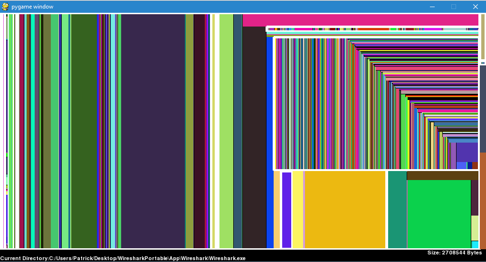

## Synopsis

Python Tree Map to map a Windows OS directory for one of my 1st year undergraduate courses.

## Installation

Python 2.7
You will need to install PyGraphics here https://pythonhosted.org/PyGraphics/install.html

## Preview

